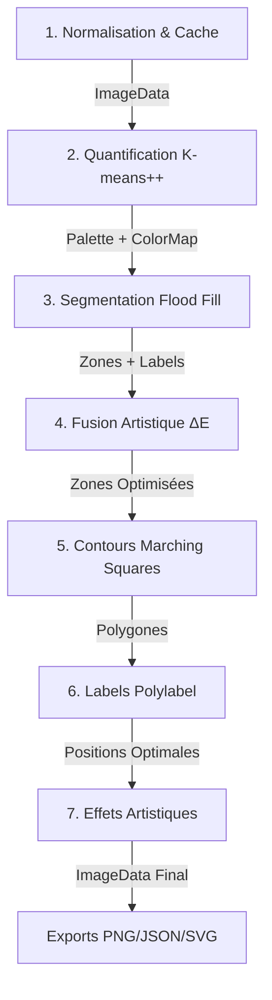

# 🎨 Canvas to Colors


*Transformez n'importe quelle photo en planche de peinture numérotée avec un studio professionnel Figma-like*

[🚀 Démarrer](#-installation--configuration) • [📖 Documentation](#-pipeline-de-traitement-dimage) • [🎯 Fonctionnalités](#-fonctionnalités-principales) • [🏗️ Architecture](#-architecture-technique)

---

## ✨ À propos

**Canvas to Colors v2.0** est un studio web professionnel de niveau Adobe/Figma pour générer des planches de peinture numérotée (Paint-by-Numbers). L'application combine :

- 🎨 **Pipeline avancé** avec analyse colorimétrique ΔE2000, quantification K-means++ et fusion artistique intelligente
- 🖼️ **Canvas interactif** de type Figma avec zoom fluide (10%-800%), pan mode, sélection de zones et overlays configurables
- ⚡ **Performance optimisée** avec Web Workers, cache LRU, ImageBitmap et Path2D pour un rendu ultra-rapide
- 🎭 **Effets artistiques** non-destructifs (huile, crayon, aquarelle, pinceau) appliqués en temps réel
- 💾 **Gestion de projets** complète avec système de favoris, recherche, tri, import/export `.pbnproj`
- 📊 **Profiling intégré** pour analyser les performances du pipeline avec timeline détaillée
- 🌓 **Système de thèmes** dark/light/système avec design tokens HSL uniformisés

---

## 🎯 Objectif & Public Cible

| Objectif | Public Cible |
|----------|--------------|
| Génération de kits complets (zones, numéros, palette, exports) à partir d'une photo en quelques minutes | Studios créatifs & agences digitales |
| Contrôle fin des paramètres avec interface Figma-like intuitive | Boutiques d'impression à la demande |
| Interface professionnelle avec zoom/pan, sélection zones, overlays | Artistes préparant des ateliers paint-by-numbers |
| Pipeline scientifique (ΔE2000, K-means++, Marching Squares, Martinez) | Équipes produit explorant la génération d'artefacts physiques |

---

## 🌟 Fonctionnalités Principales

### 🎨 Analyse Intelligente des Couleurs (Phase 1)

- **Analyse préliminaire automatique** : Détection du mode (vectoriel/photo) et recommandation de paramètres
- **Estimation de complexité** : Score de complexité visuelle (0-100) basé sur l'entropie des couleurs
- **Détection des couleurs dominantes** : Top 10 couleurs avec pondération et histogramme interactif
- **Quantification adaptive** : Pas de quantification auto-ajusté (2/4/8) selon la complexité détectée
- **Métrique ΔE2000** : Affichage du delta moyen après optimisation de palette

### ⚙️ Pipeline Paramétrable (Phase 2)

**Qualité & Fusion**
- 🎨 Nombre de couleurs : 5-40 (quantification K-means++ avec ΔE2000)
- 📏 Fusion des petites zones : 10-500px (élimination des micro-régions)
- 🌫️ Douceur des bords : 0-100% (simplification polygonale adaptive)

**Fusion Artistique** (activable)
- 🔧 Tolérance ΔE : 1-30 (regroupement perceptuel des zones similaires)
- ✨ Détection automatique des gradients et textures organiques

**Palette & Effets**
- 🎨 Palette intelligente : Équilibrage chromatique automatique avec balance Lab
- 🖌️ Effets peinture : Aquarelle, Pinceau avec intensité 0-100%
- 🎭 Effets artistiques AI : Huile, Crayon avec simulation physique

**Performance**
- 📊 Profileur de performance : Timeline détaillée des 7 étapes du pipeline

### 🖼️ Studio Interactif Figma-like (Phase 3)

**Layout Resizable**
- Panneaux gauche/droite repliables avec handles de redimensionnement
- Headers "traffic lights" inspirés macOS
- Canvas central avec fond pattern studio professionnel

**Canvas HUD Avancé**
- 🔍 Zoom : 10%-800% avec raccourcis +/- et molette souris
- 🖐️ Pan mode : Mode main pour déplacement fluide du canvas
- 👁️ Overlay numéros : Affichage/masquage avec opacité configurable (0-100%)
- 🎯 Sélection de zones : Clic simple pour zone individuelle, Ctrl+Clic pour toutes les zones d'une couleur
- ✨ Animation de surbrillance : Fade-in progressif avec glow effect sur sélection

**Multi-vues avec onglets**
- 📷 Original : Image source normalisée
- 🌈 Colorisé : Rendu avec palette quantifiée
- ✏️ Contours : Extraction Marching Squares avec union Martinez
- 🔢 Numéroté : Labels positionnés via polylabel optimal
- 🔀 Comparer : Slider interactif avant/après

**Interactions Canvas Optimisées**
- 🚀 ImageBitmap pour rendu ultra-rapide
- 🎨 Path2D précalculés pour chaque zone (O(1) hit-testing)
- 🎬 Animation de surbrillance 60fps avec requestAnimationFrame
- 🖱️ Sélection zone/couleur avec feedback visuel immédiat
- ⌨️ Raccourcis clavier : Escape pour désélectionner

### 💾 Gestion de Projets Avancée (Phase 3.3)

**EnhancedProjectManager**
- ⭐ Système de favoris avec tri prioritaire
- 🔍 Recherche en temps réel (nom/date)
- 📊 Tri multi-critères : date, nom, favoris
- 📤 Import/Export : Format `.pbnproj` avec métadonnées complètes
- 🗂️ Vue grille avec aperçus, badges de statut
- ⌨️ Raccourcis clavier : Ctrl+S (save), Ctrl+O (open), Ctrl+N (new)
- 💾 LocalStorage persistant avec auto-save optionnel

### 📤 Exports Multi-Formats

**PNG haute qualité**
- Contours, numéroté, colorisé en résolution native
- Métadonnées EXIF embarquées

**JSON structuré**
- Palette complète avec hex + statistiques
- Zones avec centroïds, surfaces, pixels
- Paramètres de génération pour reproductibilité

**SVG optimisé**
- Groupement par couleur avec attributs `fill`
- Chemins simplifiés avec Martinez polygon clipping
- Légende intégrée avec mapping couleur-numéro

### 📊 Profiling & Monitoring (Phase 3.5)

**Timeline détaillée**
- 7 étapes trackées : Normalisation, Quantification, Segmentation, Fusion, Contours, Labels, Effets
- Durée précise en ms pour chaque étape
- Graphique recharts avec barres colorées
- Temps total et breakdown en %

**Cache LRU avancé**
- Statistiques temps réel : hits, misses, hit rate
- Taille max 5 entrées avec TTL 10 minutes
- Clé paramétrique : hash image + tous les paramètres

**Indicateurs performance**
- Résolution canvas, nombre de zones, complexité palette
- Mémoire utilisée (estimation)
- FPS du canvas en mode interaction

---

## 🧪 Pipeline de Traitement d'Image

### Architecture en 7 Étapes



### Détail des Étapes

**1. Normalisation & Cache**
- Décodage de l'image source (File/Blob)
- Correction EXIF orientation automatique
- Redimensionnement intelligent avec ratio préservé
- Génération de hash CRC32-like stable pour cache
- Vérification du cache LRU avec clé paramétrique

**2. Quantification Perceptuelle**
- K-means++ avec initialisation smart (évite les convergences locales)
- Distance ΔE2000 pour clustering perceptuel précis
- Consolidation de palette : fusion des couleurs imperceptibles (ΔE < 5)
- Balance chromatique Lab (si palette intelligente activée)
- Échantillonnage adaptatif selon taille image (stride 8/16/24)

**3. Segmentation des Zones**
- Flood fill optimisé 4-connexité avec stack non récursif
- Calcul des centroïds (centre de gravité) et surfaces
- Attribution d'ID unique à chaque zone
- Génération d'une Int32Array de labels (width × height)

**4. Fusion Artistique**
- Regroupement des zones selon 3 critères :
  - Surface minimale (minRegionSize)
  - Proximité colorimétrique (mergeTolerance ΔE)
  - Adjacence spatiale (frontière commune)
- Détection des gradients et fusion des micro-régions
- Statistiques de fusion (zones avant/après, % de réduction)

**5. Contours & Polygones**
- Marching Squares pour extraction de contours vectoriels
- Union polygonale Martinez pour fusionner les zones multi-composantes
- Simplification adaptive avec simplify-js (tolérance basée sur smoothness)
- Génération de chemins SVG avec courbes de Bézier

**6. Placement des Labels**
- Polylabel pour trouver le pole of inaccessibility optimal (centre visuel)
- Calcul de surface minimale requise pour affichage du numéro
- Génération de légende avec mapping couleur ↔ numéro

**7. Effets Optionnels**
- **Huile** : Quantification locale 32 niveaux + texture canvas aléatoire
- **Crayon** : Conversion grayscale + Sobel edges + hatching directionnel
- **Aquarelle** : Bloom lumineux + saturation accrue (post-processing)
- **Pinceau** : Texture brush strokes avec variations d'opacité

---

## 🏗️ Architecture Technique

### Structure du Projet

```
src/
├── components/                 # Composants UI métier
│   ├── studio/                # Layout studio Figma-like
│   │   ├── StudioLayout.tsx         # Layout 3 panneaux resizable
│   │   ├── EnhancedViewTabs.tsx     # Onglets multi-vues avec compare
│   │   ├── CanvasHUD.tsx            # HUD zoom/pan/overlay
│   │   ├── CompareSlider.tsx        # Slider avant/après interactif
│   │   ├── EnhancedProjectManager.tsx # Gestion projets avancée
│   │   ├── ExportBar.tsx            # Barre d'export multi-formats
│   │   ├── DebugPanel.tsx           # Panel debug zones/palette
│   │   ├── ProfilerPanel.tsx        # Timeline de performance
│   │   ├── InspectionOverlay.tsx    # Overlay inspection zones
│   │   └── ResizableStudioLayout.tsx # Variante ResizablePanels
│   ├── ui/                    # Composants shadcn/ui
│   │   ├── button.tsx, card.tsx, slider.tsx, ...
│   │   └── (40+ composants shadcn)
│   ├── Canvas.tsx             # Canvas principal avec interactions
│   ├── ImageUpload.tsx        # Upload avec drag-drop et validation
│   ├── ParametersPanel.tsx    # Panel paramètres avec sections collapsibles
│   ├── ColorAnalysisPanel.tsx # Panel analyse avec histogramme
│   ├── ColorPalette.tsx       # Affichage palette avec swatches
│   ├── PalettePanel.tsx       # Panel palette interactive
│   ├── HistoryPanel.tsx       # Historique projets cloud
│   ├── AuthPanel.tsx          # Authentification Supabase
│   ├── ProcessingProgress.tsx # Barre de progression animée
│   ├── Header.tsx             # Header avec logo et theme toggle
│   ├── ThemeProvider.tsx      # Provider next-themes
│   └── ThemeToggle.tsx        # Toggle dark/light/system
├── contexts/
│   └── StudioContext.tsx      # Context global avec zoom, overlay, profiler
├── hooks/                     # Hooks personnalisés
│   ├── useAuth.ts             # Authentification Supabase
│   ├── useCanvasInteractions.ts # Interactions canvas (zoom, pan, select)
│   ├── useExport.ts           # Export PNG/JSON/SVG
│   ├── useImageHistory.ts     # Historique cloud avec pagination
│   ├── useProfiler.ts         # Profiling performance
│   ├── useUserProfile.ts      # Profil utilisateur persisté
│   ├── useAutoSave.ts         # Auto-save projets
│   └── useWindowSize.ts       # Dimension fenêtre pour confetti
├── lib/                       # Logique métier & traitement
│   ├── imageProcessing.ts     # Pipeline principal (2500+ lignes)
│   ├── imageProcessingWorker.ts # Worker wrapper
│   ├── artisticEffects.ts     # Effets huile/crayon
│   ├── postProcessing.ts      # Effets aquarelle/brush
│   ├── colorUtils.ts          # ΔE2000, Lab, balance palette
│   ├── regionMerge.ts         # Fusion artistique
│   ├── exportSvg.ts           # Export SVG optimisé
│   ├── imageNormalization.ts  # Normalisation & resize
│   ├── lruCache.ts            # Cache LRU générique
│   └── utils.ts               # Utilitaires divers
├── workers/
│   └── imageProcessor.worker.ts # Web Worker pour processing
├── integrations/supabase/
│   ├── client.ts              # Client Supabase
│   └── types.ts               # Types DB auto-générés
├── config/
│   └── constants.ts           # Constantes globales
├── pages/
│   ├── Index.tsx              # Page principale
│   └── NotFound.tsx           # Page 404
├── styles/
│   └── theme-pro.css          # Thème studio professionnel
├── index.css                  # Design tokens HSL (dark/light)
└── main.tsx                   # Point d'entrée React
```

### Technologies Clés

**Front-end**
- ⚛️ React 18.3.1 avec hooks avancés (useCallback, useMemo, useRef pour performance)
- 📘 TypeScript 5.0+ avec typage strict
- ⚡ Vite pour build ultra-rapide avec HMR
- 🎨 Tailwind CSS avec design tokens HSL uniformisés
- 🧩 shadcn/ui pour composants accessibles et customisables
- 🌓 next-themes pour gestion thèmes dark/light/system

**Traitement d'image**
- 🖼️ Canvas API avec ImageData, ImageBitmap, Path2D
- 📐 Marching Squares (librairie `marchingsquares`)
- 🔺 Martinez Polygon Clipping (`martinez-polygon-clipping`)
- 📍 Polylabel (`polylabel`) pour placement optimal labels
- 📉 Simplify.js (`simplify-js`) pour simplification polygonale
- 🎨 ΔE2000 (implémentation custom) pour distance perceptuelle
- 🔢 K-means++ avec initialisation smart

**Backend & Cloud**
- ☁️ Supabase (Lovable Cloud) pour auth, DB, storage
- 🗄️ PostgreSQL avec RLS policies
- 🔐 Authentification JWT avec refresh tokens
- 📦 Row Level Security pour isolation des données utilisateur

**Performance & Monitoring**
- 👷 Web Workers pour traitement off-main-thread
- 💾 LRU Cache avec TTL et statistiques
- 📊 Profiler custom avec timeline recharts
- 🎬 requestAnimationFrame pour animations 60fps

---

## 🎨 Design System

### Tokens HSL Uniformisés

Tous les composants utilisent les tokens CSS définis dans `src/index.css` :

**Light Mode**
```css
--background: 240 20% 99%;      /* Fond principal */
--foreground: 260 40% 12%;      /* Texte principal */
--primary: 262 83% 58%;         /* Couleur primaire (violet) */
--accent: 25 95% 63%;           /* Couleur accent (orange) */
--border: 240 15% 90%;          /* Bordures */
--card: 0 0% 100%;              /* Fond cartes */
```

**Dark Mode**
```css
--background: 260 40% 8%;       /* Fond sombre */
--foreground: 240 20% 98%;      /* Texte clair */
--primary: 262 83% 58%;         /* Primaire (identique) */
--accent: 25 95% 63%;           /* Accent (identique) */
--border: 260 25% 20%;          /* Bordures sombres */
--card: 260 35% 12%;            /* Fond cartes sombre */
```

**Gradients & Effets**
```css
--gradient-primary: linear-gradient(135deg, hsl(262 83% 58%), hsl(262 90% 70%));
--gradient-mesh: radial-gradient(...); /* Fond mesh subtil */
--shadow-elegant: 0 10px 30px -10px hsl(262 83% 58% / 0.3);
--shadow-glow: 0 0 40px hsl(262 83% 58% / 0.4);
--glass-bg: hsl(240 20% 99% / 0.7); /* Glassmorphism */
```

**Thème Studio** (`theme-pro.css`)
- Traffic lights macOS (rouge/jaune/vert)
- Panneaux avec backdrop-blur et glassmorphism
- Canvas avec pattern grille subtile
- Bordures et séparateurs fins avec opacité

---

## 🚀 Installation & Configuration

### Prérequis

- Node.js 18+ 
- npm ou yarn
- Navigateur moderne (Chrome/Edge/Safari/Firefox)

### Installation

```bash
# Cloner le dépôt
git clone <repo-url>
cd canvas-to-colors

# Installer les dépendances
npm install

# Démarrer le serveur de développement
npm run dev
```

L'application sera disponible sur [http://localhost:5173](http://localhost:5173).

### Variables d'Environnement

Le fichier `.env` est auto-généré par Lovable Cloud (ne pas modifier manuellement) :

```env
VITE_SUPABASE_URL=https://xxxxx.supabase.co
VITE_SUPABASE_PUBLISHABLE_KEY=eyJhbGciOi...
VITE_SUPABASE_PROJECT_ID=xxxxx
```

---

## 📜 Commandes Disponibles

| Commande | Description |
|----------|-------------|
| `npm run dev` | Lance Vite en mode développement avec HMR |
| `npm run build` | Compile la version production optimisée |
| `npm run build:dev` | Build avec configuration development (profiling) |
| `npm run preview` | Sert la build production localement |
| `npm run lint` | Analyse le code avec ESLint |

---

## 🎬 Expérience Utilisateur

### Workflow Complet

1. **📤 Importer une image**
   - Drag & drop ou clic sur zone upload
   - Validation format (PNG/JPG) et taille (max 10MB)
   - Aperçu immédiat avec URL.createObjectURL
   - Normalisation asynchrone avec redimensionnement intelligent

2. **🔍 Analyser automatiquement**
   - Détection mode vectoriel/photo
   - Calcul complexité visuelle (entropie)
   - Recommandation paramètres optimaux
   - Affichage des 10 couleurs dominantes avec histogramme

3. **⚙️ Configurer le pipeline**
   - Ajuster nombre de couleurs (5-40)
   - Configurer fusion zones (10-500px)
   - Activer fusion artistique ΔE si nécessaire
   - Choisir palette intelligente et effets peinture
   - Sélectionner effets AI (huile/crayon)

4. **⚡ Traiter l'image**
   - Clic sur "Générer le modèle"
   - Processing dans Web Worker (non-bloquant)
   - Barre de progression avec étapes détaillées
   - Confetti animé à la fin 🎉

5. **👁️ Explorer le rendu**
   - Onglets Original / Colorisé / Contours / Numéroté / Comparer
   - Zoom molette souris (10%-800%)
   - Pan mode avec clic-glisser
   - Sélection zones : clic simple ou Ctrl+Clic pour couleur complète
   - Overlay numéros avec opacité configurable

6. **💾 Sauvegarder & Partager**
   - Clic sur "Sauvegarder le projet"
   - Nom personnalisé + marquage favori
   - Export PNG (contours/numéroté/colorisé)
   - Export JSON (données structurées)
   - Export SVG (vectoriel optimisé)
   - Import/Export `.pbnproj` pour portabilité

7. **📊 Profiler les performances**
   - Activer le profileur dans Paramètres > Performance
   - Consulter la timeline détaillée dans ProfilerPanel
   - Analyser les étapes gourmandes en temps
   - Vérifier les statistiques du cache LRU

---

## 🧪 Tests & Validation

### Scénarios de Test

**Test de robustesse**
- Images de 100×100 à 4000×4000 pixels
- Formats variés : PNG, JPG, JPEG
- Palettes de 5 à 40 couleurs
- Photos complexes vs illustrations vectorielles

**Test de performance**
- Vérifier cache LRU avec images identiques
- Mesurer FPS canvas en mode zoom/pan
- Profiler les 7 étapes du pipeline
- Tester Web Worker avec images lourdes (>5MB)

**Test d'interactions**
- Zoom molette fluide sans saccades
- Pan mode réactif
- Sélection zone avec feedback visuel immédiat
- Overlay numéros avec opacité fonctionnelle

**Test d'exports**
- PNG haute qualité avec métadonnées
- JSON valide avec palette complète
- SVG fonctionnel et optimisé
- Import/Export `.pbnproj` sans perte de données

---

## 🔧 Optimisations Avancées

### Performance Canvas

**ImageBitmap pour rendu ultra-rapide**
```typescript
// Conversion ImageData → ImageBitmap (1 seule fois)
const bitmap = await createImageBitmap(imageData);

// Rendu instantané (beaucoup plus rapide que putImageData)
ctx.drawImage(bitmap, 0, 0);
```

**Path2D précalculés**
```typescript
// Précalcul des chemins pour chaque zone
const zonePaths = new Map<number, Path2D>();
zones.forEach(zone => {
  const path = new Path2D();
  zone.pixels.forEach(idx => {
    const x = idx % width;
    const y = Math.floor(idx / width);
    path.lineTo(x, y);
  });
  path.closePath();
  zonePaths.set(zone.id, path);
});

// Hit-testing O(1) avec isPointInPath
const clickedZone = Array.from(zonePaths).find(([id, path]) =>
  ctx.isPointInPath(path, mouseX, mouseY)
);
```

**Animation 60fps avec RAF**
```typescript
const animate = () => {
  const progress = Math.min((Date.now() - startTime) / duration, 1);
  setHighlightProgress(progress);
  
  if (progress < 1) {
    requestAnimationFrame(animate);
  }
};
requestAnimationFrame(animate);
```

### Cache LRU Paramétrique

**Clé de cache composite**
```typescript
const cacheKey = `${imageHash}_${numColors}_${minRegionSize}_${smoothness}_${mergeTolerance}_${enableArtisticMerge}`;

// Vérification cache avant traitement
const cached = resultCache.get(cacheKey);
if (cached) {
  console.log('✨ Cache hit! Gain de temps:', cached.metadata.totalProcessingTimeMs);
  return cached;
}

// Stockage après traitement
resultCache.set(cacheKey, result);
```

**Statistiques temps réel**
```typescript
const stats = resultCache.getStats();
console.log(`Cache: ${stats.hits} hits, ${stats.misses} misses, ${stats.hitRate}% hit rate`);
```

---

## 🤝 Contribuer

Les contributions sont les bienvenues ! Pour proposer une amélioration :

1. Fork le projet
2. Créer une branche feature (`git checkout -b feature/amazing-feature`)
3. Commit les changements (`git commit -m 'Add amazing feature'`)
4. Push vers la branche (`git push origin feature/amazing-feature`)
5. Ouvrir une Pull Request

### Guidelines de Code

- Utiliser TypeScript avec typage strict
- Suivre les conventions de nommage (camelCase pour variables, PascalCase pour composants)
- Documenter les fonctions complexes avec JSDoc
- Utiliser les design tokens HSL du `index.css` (jamais de couleurs hardcodées)
- Tester les performances avec le profileur intégré

---

## 📝 Changelog

### v2.0.0 (Actuel)

**Nouvelles fonctionnalités majeures**
- ✨ Studio Figma-like avec panneaux resizable et canvas HUD complet
- 🎨 Effets artistiques AI (huile, crayon) et effets peinture (aquarelle, pinceau)
- 🖼️ Canvas interactif avec zoom 10%-800%, pan mode, sélection zones/couleurs
- 📊 Profiler de performance avec timeline détaillée des 7 étapes
- 💾 Gestionnaire de projets avancé avec favoris, recherche, tri, import/export
- 🌓 Système de thèmes dark/light/system avec next-themes
- ⚡ Optimisations : ImageBitmap, Path2D, cache LRU paramétrique

**Améliorations**
- Analyse couleurs avec détection mode vectoriel/photo
- Pipeline refactorisé avec consolidation de palette (fusion couleurs ΔE < 5)
- Interface modernisée avec design tokens HSL uniformisés
- Composants shadcn/ui accessibles et customisables

### v1.0.0 (Base)

- Pipeline de base avec K-means et segmentation flood fill
- Export PNG/JSON/SVG
- Paramètres numColors, minRegionSize, smoothness
- Interface simple avec upload et rendu

---

## 📄 Licence

MIT License - voir le fichier [LICENSE](LICENSE) pour plus de détails.

---

## 🙏 Remerciements

Ce projet utilise les technologies suivantes :

- [React](https://react.dev/) - Librairie UI
- [TypeScript](https://www.typescriptlang.org/) - Langage typé
- [Vite](https://vitejs.dev/) - Build tool ultra-rapide
- [Tailwind CSS](https://tailwindcss.com/) - Framework CSS utility-first
- [shadcn/ui](https://ui.shadcn.com/) - Composants accessibles
- [Supabase](https://supabase.com/) - Backend as a Service
- [Marching Squares](https://www.npmjs.com/package/marchingsquares) - Extraction contours
- [Martinez Polygon Clipping](https://www.npmjs.com/package/martinez-polygon-clipping) - Union polygones
- [Polylabel](https://www.npmjs.com/package/polylabel) - Placement labels optimal
- [Simplify.js](https://www.npmjs.com/package/simplify-js) - Simplification polygonale
- [next-themes](https://www.npmjs.com/package/next-themes) - Gestion thèmes
- [Recharts](https://recharts.org/) - Graphiques interactifs
- [Lucide React](https://lucide.dev/) - Icônes modernes

Un grand merci à la communauté open-source pour ces outils exceptionnels ! 🎉

---

**[⬆ Retour en haut](#-canvas-to-colors)**
