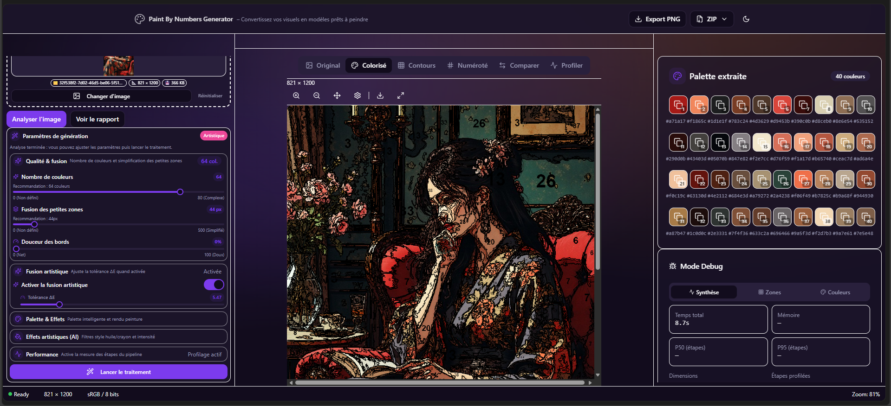

# 🎨 Canvas to Colors


> **Transformez n'importe quelle photo en planche de peinture numérotée**  
> Interface studio professionnelle façon Figma, avec pipeline d'analyse colorimétrique avancé.

---

## 🚀 Aperçu rapide

**Canvas to Colors** est un studio web de niveau pro pour générer des kits *Paint-by-Numbers* complets à partir d'images.  
Conçu pour **studios créatifs**, **imprimeurs** et **artistes**, il combine rigueur scientifique et expérience visuelle fluide.

### Fonctionnalités clés
- 🎨 **Analyse intelligente des couleurs** (ΔE2000, K-means++, histogramme interactif)
- ⚙️ **Pipeline paramétrable** : fusion, adoucissement, effets artistiques
- 🖼️ **Canvas Figma-like** : zoom 10%-800%, pan fluide, overlays et sélection
- 💾 **Gestion de projets** : favoris, recherche, import/export `.pbnproj`
- 📤 **Exports pro** : PNG, JSON, SVG vectoriel
- 📊 **Profiling intégré** : timeline de performance et cache LRU
- 🌓 **Thème dark/light/système** + design system HSL uniforme

---

## ⚡ Installation rapide

### Prérequis
- Node.js 18+
- npm ou yarn  
- Navigateur moderne (Chrome, Edge, Firefox, Safari)

### Commandes
```bash
git clone <repo-url>
cd paint-by-numbers-generator
npm install
npm run dev
```

Accès sur [http://localhost:5173](http://localhost:5173)

---

## 🧠 Pipeline & Architecture

Le traitement suit **7 étapes optimisées** :

1. Normalisation & cache
2. Quantification K-means++ (ΔE2000)
3. Segmentation & fusion artistique
4. Extraction des contours
5. Placement intelligent des labels
6. Effets peinture & artistiques
7. Exports multi-format

🔬 Détails complets : [`docs/pipeline.md`](./docs/pipeline.md)
🏗️ Architecture et design system : [`docs/architecture.md`](./docs/architecture.md)

---

## 🧩 Stack Technique

| Catégorie            | Technologies                                       |
| -------------------- | -------------------------------------------------- |
| **Front-end**        | React 18, TypeScript 5, Vite, Tailwind, shadcn/ui  |
| **Image Processing** | Canvas API, Path2D, K-means++, Martinez, Polylabel |
| **Backend**          | Supabase (Auth, DB, Storage)                       |
| **Performance**      | Web Workers, LRU Cache, Profiler custom            |
| **UI/UX**            | Design tokens HSL, thèmes dark/light               |

---

## 📸 Aperçu du studio



---

## 🤝 Contribution

Les PR sont bienvenues !

1. Fork le projet
2. `git checkout -b feature/amazing-feature`
3. `git commit -m "feat: add amazing feature"`
4. `git push origin feature/amazing-feature`
5. Ouvre ta Pull Request 🎉

### Règles de code

* TypeScript strict
* Aucune couleur hardcodée (utiliser les tokens HSL)
* Documenter les fonctions complexes
* Profilage avant chaque merge

---


## 📄 Licence

MIT © 2025 — **Franck**

---

## 🙏 Remerciements

Merci à la communauté open-source ❤️
React • TypeScript • Tailwind • Supabase • shadcn/ui • Recharts • Martinez • Polylabel • Simplify.js

---

**[⬆ Retour en haut](#-paint-by-numbers-generator--v20)**
